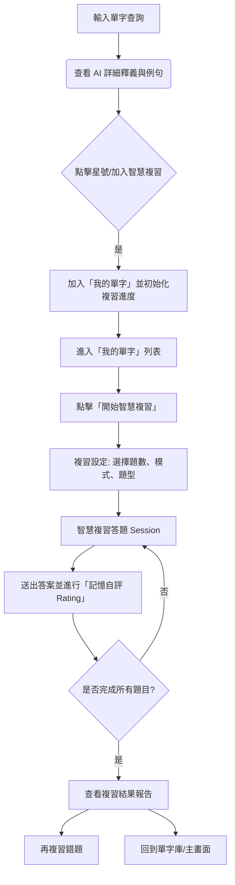
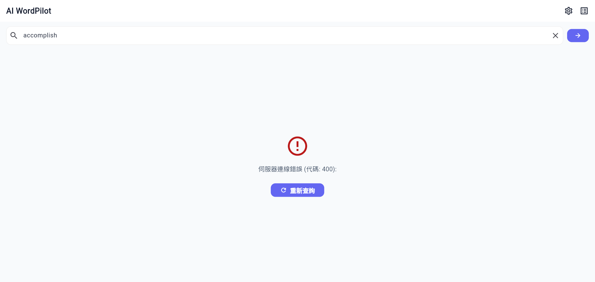
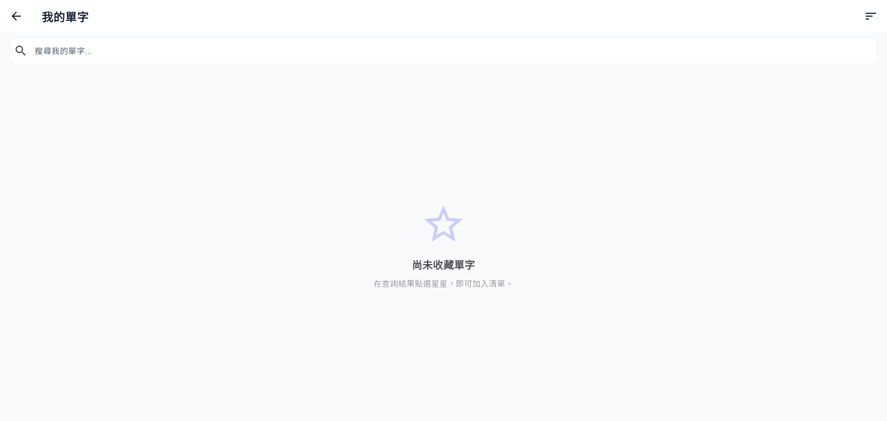
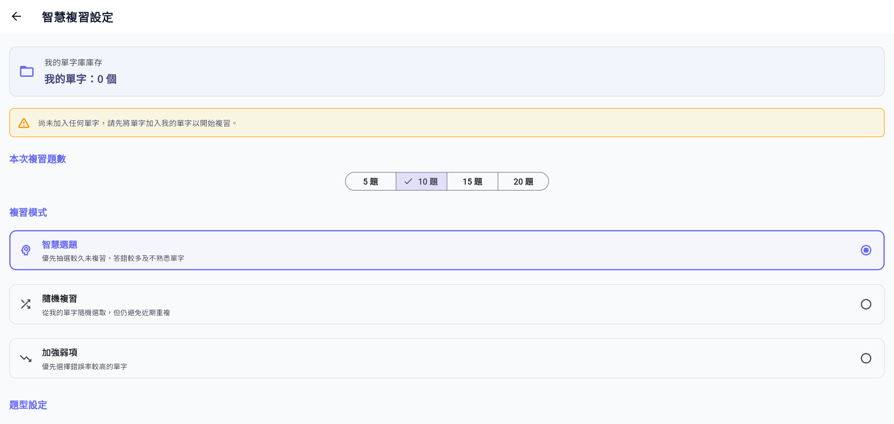
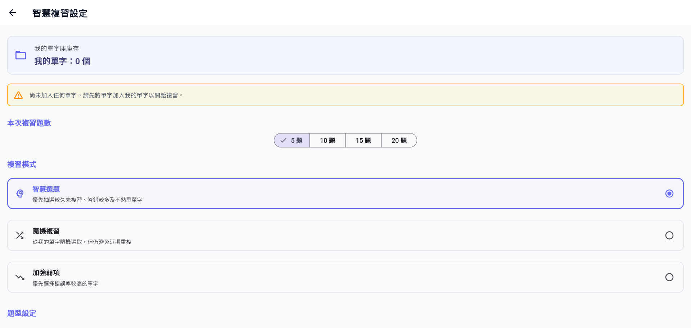
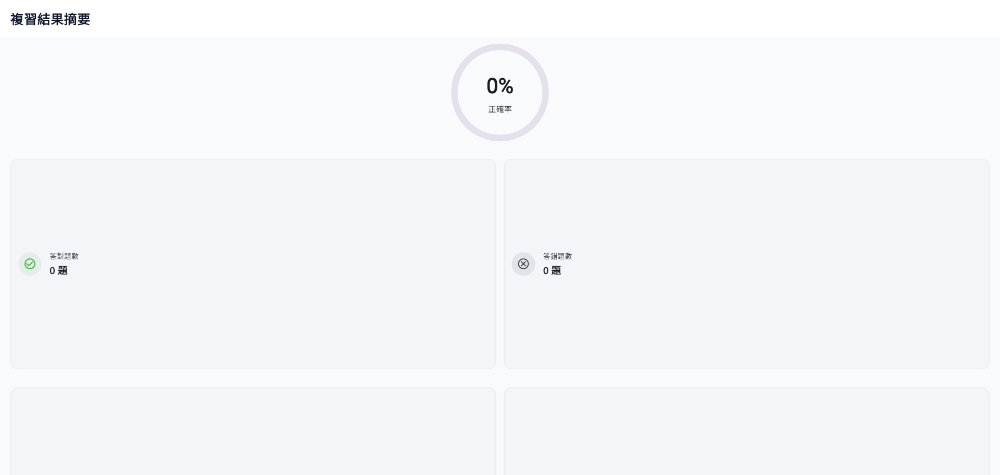

# AI WordPilot (智慧單字學習系統)

**Live Demo**: [AI WordPilot](https://ai-eng-axhwj6whw-eaglechen-9925s-projects.vercel.app/)

AI WordPilot 是一款結合 Google Gemini 語意分析與間隔重複（Spaced Repetition）演算法的智慧英文單字學習系統。本系統專為提升使用者的單字記憶效率而設計，不僅提供詳細的 AI 單字解析，還能自動為您安排複習時程。

---

## 系統核心功能

### 1. AI 智慧單字查詢與解析 (AI Dictionary Lookup)
* **雙語詳細釋義**：輸入單字後，由 AI 自動解析最符合的傳統中文翻譯與詳細英文解釋。
* **豐富中英例句**：針對單字的不同詞性（名詞、動詞、形容詞等）提供對應的例句與中文翻譯，並將關鍵字高亮顯示。
* **完整單字屬性**：
  * **CEFR 分級**：A1 至 C2 等級標章，清楚掌握單字難度。
  * **詞頻統計**：極常用、常用、中等常用、罕見等詞頻提醒。
  * **變化形與家族字**：原型、第三人稱單數、現在分詞、過去式、複數形式等，以及家族字彙。
* **相似/混淆單字辨析**：分析相似字、反義字，並提供詳細的語境差異對比卡片，點擊即可進行多單字深入對比。
* **雙音標與語音朗讀**：提供美式（US）與英式（UK）音標，並整合 Text-to-Speech (TTS) 服務，一鍵播放標準發音。

### 2. 我的單字收藏與對比清單 (Favorites & Word Comparison)
* **單字收藏**：一鍵將查詢的單字加入我的最愛，做為個人專屬的單字庫。
* **詞組對比收藏**：可將 AI 產生的「單字比較資料」單獨收藏，便於日後快速複習混淆字彙。
* **關鍵字搜尋**：在收藏庫中快速過濾單字。
* **智慧複習同步**：加入/移出收藏時，系統會自動在背景初始化或清除該單字的智慧複習進度，確保資料庫一致。

### 3. 加權間隔重複複習系統 (Weighted Spaced Repetition Review)
* **只複習收藏內容**：複習題庫完全基於使用者的「我的單字」，確保學習的實用與針對性。
* **四種智慧題型（離線生成）**：
  1. **英翻中 (en_to_zh)**：英文單字選中文釋義。
  2. **中翻英 (zh_to_en)**：中文釋義選英文單字。
  3. **情境選字 (context_choice)**：根據 AI 例句挖空選擇最適合的單字填入。
  4. **相似字辨識 (similar_word_choice)**：根據情境選出最自然、最貼切的相似單字。
  * *註：干擾選項由系統演算法從您的收藏單字庫中自動篩選詞性相同、相似的字彙生成，無需即時呼叫 LLM，節約流量且支持離線運作。*
* **智慧加權選題演算法**：
  * **時間過期權重 (Overdue Factor)**：越久未複習的單字權重越高。
  * **錯誤率權重 (Error Factor)**：答錯次數多的單字出現機率更高。
  * **熟悉度調整 (Learning Status)**：新單字與學習中單字優先出現，已掌握的單字降低出現率。
  * **近期重覆懲罰 (Recent Penalty)**：避免連續或短時間內重覆出現相同單字或相同題型。
* **自我記憶回饋 (Self Rating)**：答題後提供四種難度自評：**忘記了 (Forgot)**、**有點難 (Hard)**、**記得 (Good)**、**很簡單 (Easy)**，動態調整下一次複習的間隔天數與單字熟悉度級別（`New` -> `Learning` -> `Familiar` -> `Mastered`）。

---

## 系統操作流程 (Operation Flow)

### 1. 查詢與收藏流程
1. 在主頁搜尋框輸入欲學習的單字（例如 `accomplish`），點擊搜尋。
2. 瀏覽 AI 生成的翻譯、詞性、例句、CEFR 等級與單字對比。
3. 點擊頁面下方的 **「加入智慧複習」** 卡片，或點擊右上角星號，將單字加入我的最愛。

### 2. 啟動複習流程
1. 切換至 **「我的單字」** 頁面。
2. 點擊右下角的 **「開始智慧複習 (School Icon)」** 懸浮按鈕。
3. 進入 **「複習設定」**：
   * 選擇本次複習題數（5、10、15、20 題）。
   * 選擇複習模式：**智慧選題**（加權排序）、**隨機複習**、**加強弱項**（優先錯誤率高者）。
   * 勾選欲練習的題型（英翻中、中翻英、情境選字、相似字辨識）。
4. 點擊 **「開始複習」** 按鈕。

### 3. 複習答題與自評流程
1. 畫面頂端會顯示進度條與當前題型晶片（如「情境選字」）。
2. 閱讀題目，點選答案選項後點擊 **「確認答案」**。
3. 系統即時顯示正確/錯誤回饋，並播放 TTS 發音。
4. **關鍵步驟**：下方會彈出 **「你覺得這個單字如何？」** 自評按鈕：
   * **忘記了**：下一次複習間隔重置為 1 天。
   * **有點難**：小幅增加複習間隔。
   * **記得**：複習間隔乘倍增長。
   * **很簡單**：大幅拉長複習間隔（最長 180 天）。
5. 點擊 **「下一題」** 繼續。

### 4. 複習結果與錯題加強
1. 完成所有題目後進入 **「複習結果」** 頁面，顯示正確率、答對與答錯題數統計。
2. 頁面會分類列出 **「需要加強」**（答錯或自評為忘記/有點難）與 **「表現良好」** 的單字。
3. 可點擊 **「再複習錯題」** 快速建立一個只包含剛才答錯單字的複習 Session，直到完全記住。

---

## 系統 UI 說明與示意圖

以下為系統核心畫面的 UI 規劃與截圖（請將實際截圖放置於專案根目錄的 `image/` 資料夾下）：

### 1. 單字查詢主畫面
在主畫面提供極簡好看的搜尋框，查詢後呈現精緻的 Material 3 卡片式排版。

### 2. 我的單字收藏庫
列出所有已收藏的單字與混淆字對比卡片，右下角為啟動智慧複習的入口。

### 3. 複習設定面板
可自訂題數、選題模式與啟用題型，系統會顯示目前可供複習的單字總數。

### 4. 智慧複習答題介面
提供清晰的進度條、題目區與按鈕，答題後呈現自評區（Forgot / Hard / Good / Easy）。

### 5. 複習結果統計
直觀的正確率環狀/條狀視覺回饋，並列出待加強單字，提供「再複習錯題」快捷鍵。

---

## 專題技術架構 (Technology Stack)

本專題採用現代化的軟體開發架構，強調模組化、強型別安全與優良的使用者體驗：

### 1. 前端開發框架
* **Flutter & Dart**：使用 Google Flutter SDK 進行跨平台開發，確保 Web、Mobile (iOS/Android) 及 Desktop 端擁有一致的流暢體驗。

### 2. 狀態管理與相依注入
* **Riverpod (Flutter Riverpod)**：
  * 使用 `StateNotifier` 管理複習狀態（Active Session, Answers）。
  * 透過 `FutureProvider` 與 `Provider` 進行非同步資料載入與 UI 狀態過濾。
  * 解耦資料層（Repository）與展示層（UI Widget）。

### 3. AI 語意整合
* **Google Gemini API**：結合最新的大型語言模型，依據自訂的 JSON Schema 提示詞（Prompt），生成結構化且符合 CEFR 標準的單字字典檔案（包含例句、IPA 音標、相似字對比等資訊）。

### 4. 本地持久化資料庫與安全性
* **Flutter VM (Mobile/Desktop)**：
  * **原子寫入 (Atomic Writes)**：所有存檔先寫入暫存檔 (`.tmp`)，寫入成功後再進行更名覆蓋，防止因寫入中斷導致 JSON 損毀。
  * **損毀備份復原 (Corruption Recovery)**：在讀取 JSON 時若偵測到格式錯誤（例如意外關機導致的損壞），系統會自動將受損檔案更名為 `.bak` 備份，並重置初始化 Blank 資料，保證 App 不崩潰。
* **Flutter Web**：
  * 使用 **SharedPreferences** 做為 Web 瀏覽器 local storage 的快取引擎。

### 5. 動態加權間隔重複演算法 (SRS)
* 系統根據 SuperMemo-2 (SM2) 原理簡化設計了單字複習間隔公式。藉由答題結果（Correct/Incorrect）與使用者自評分數（Forgot: 0, Hard: 1, Good: 2, Easy: 3），動態更新複習間隔天數（`currentIntervalDays`）與熟悉度等級，達成最高效的記憶維持率。

### 6. 主題與人因介面
* **Material Design 3**：全面支援 Light / Dark Mode，具備和諧的 CEFR 難度分級顏色系統、流暢的進度條微動畫、與人因工程的單手自評按鈕區。
